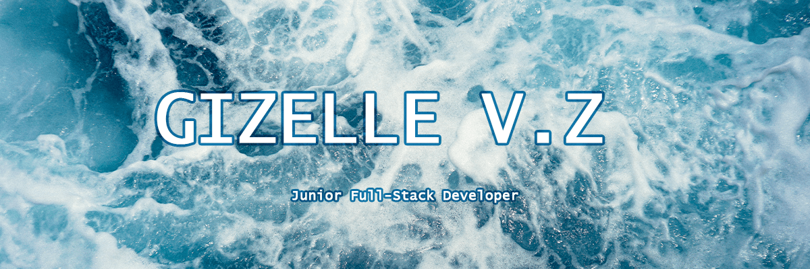
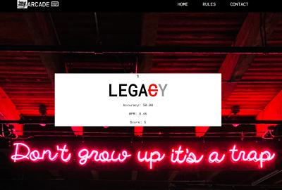
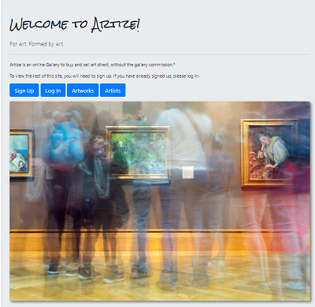
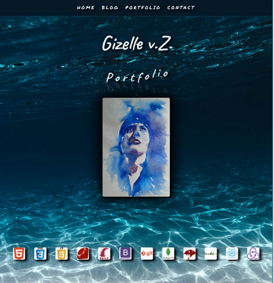
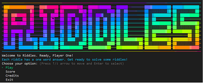

I am a current student at Coder Academy undertaking a full-stack web-development bootcamp, seeking to gain industry experience following course completion in August 2021.

I am a creative personality with a passion for the arts, learning and research. I love coffee, reading, playing games and watching film, series etc.

I currently yield the powers of: HTML, CSS, Git, Ruby, Rails, JavaScript, APIs and React. 
  

    
    
    
    
    
    
    
    
    
    
    
    
    

  
I plan on expanding my skills to include: MongoDB and Node.js.
  
Feel free to have a look at some of my projects:  

<a href="https://github.com/Ellezique/Arcade-Secretary-as-deployed" width="100%" >
</a>

<a href="https://github.com/Ellezique/Artize-/" width="100%">
</a>

<a href="https://github.com/Ellezique/portfolio-website/" width="100%">
</a>

<a href="https://github.com/Ellezique/ruby-riddles-game" width="100%">
</a>

<!--
**Ellezique/Ellezique** is a ✨ _special_ ✨ repository because its `README.md` (this file) appears on your GitHub profile.

Here are some ideas to get you started:

- 🔭 I’m currently working on ...
- 🌱 I’m currently learning ...
- 👯 I’m looking to collaborate on ...
- 🤔 I’m looking for help with ...
- 💬 Ask me about ...
- 📫 How to reach me: ...
- 😄 Pronouns: ...
- ⚡ Fun fact: ...
-->
