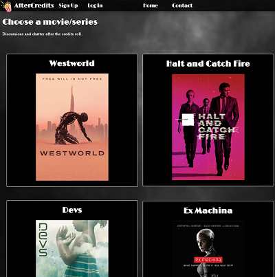

I completed a full-stack web-development bootcamp in 2021 and am seeking to gain industry experience as an emerging developer.

I am a creative personality with a passion for the arts, learning and research. 

I have worked with HTML, CSS, Git, Ruby, Rails, JavaScript, APIs and React. 
  

    
    
    
    
    
    
    
    
    
    
    
    
    
    
    
    
    
    
    
    

  
  

 I am currently learning Python. Thereafter, I would like to build an app using Node and MongoDB.

 
    
    
    

  
I started coding on an Aftershock gaming laptop with Windows OS, using Ubuntu terminal and VS Code. I have set up a virtual machine (Oracle VM VirtualBox and Debian OS) and will explore this further in future. I recently switched to a Linode server with remote SSH so that I can continue coding on VS Code (installation is painfree compared to Windows and Ubuntu). I am currently working with Python, Matplotlib, NumPy, Jupyter Notebooks and MobaXTerm (pop up video output).

  
Feel free to have a look at some of my existing projects (please note that there are some movie/series card and chatroom bugs in the current version of AfterCredits):  

<a href="https://github.com/Ellezique/Full-Stack-App-PART-A" width="100%" >
</a>

<a href="https://github.com/Ellezique/Arcade-Secretary-as-deployed" width="100%" >
</a>

<a href="https://github.com/Ellezique/Artize-/" width="100%">
</a>

<a href="https://github.com/Ellezique/portfolio-website/" width="100%">
</a>

<a href="https://github.com/Ellezique/ruby-riddles-game" width="100%">
</a>

<!--
To display project linked images in a one row, two column format, generate a table at:
https://tableconvert.com/
-->
