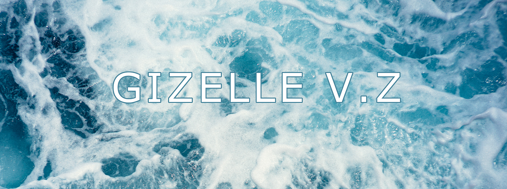

  I am a Full Stack Developer. I have a passion for the arts, learning, and research.
    
  I work with Git, HTML, CSS, Ruby, Rails, JavaScript, React, Meteor, Angular, Python, Typescript, MySQL, PostgreSQL, MongoDB, Firestore, Google Cloud Platform, Terraform, Azure Pipelines, APIs, etc.

  

    
    
    
    
    
    
    
    
    
    
    
    
    
    
    
    
    
    
    
     
    
    
    

  

  Feel free to have a look at some of my repositories:
    
  <a href="https://github.com/Ellezique/offworld-gym/tree/Ellezique_Gizelle">Offworld Gym</a> 
  <a href="https://github.com/Ellezique/Python-workshop-tasks-W3-Deep-Q-Learning">Python workshop tasks, Week 3, Deep Q Learning</a> 
  <a href="https://github.com/Ellezique/Python-workshop-tasks-W2-Reinforcement-Learning">Python workshop tasks, Week 2, Reinforcement-Learning</a> 
  <a href="https://github.com/Ellezique/Python-workshop-tasks-W1">Python workshop tasks, Week 1, Algorithms and Matrices</a>

  

  

  

  

  

<!--
To display project linked images in a one row, two column format, generate a table at:
https://tableconvert.com/
-->
